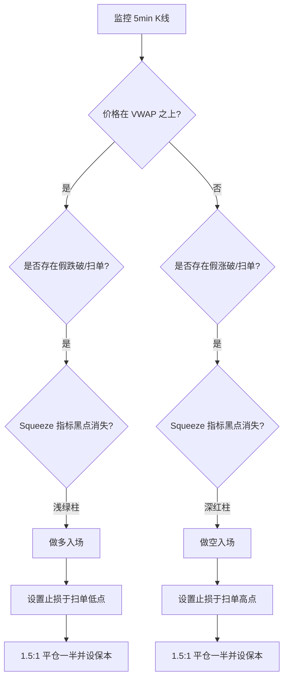

这份完整的 BTC 5min 短线策略实现方案，结合了**机构公允价值（VWAP）**、**波动率挤压（Squeeze）**以及**流动性掠夺（Liquidity Sweep）**。该方案旨在通过多重过滤，将胜率（Win Rate）提升至 60% 以上，并保持良好的风险报酬比（Risk/Reward Ratio）。

### **策略名称：BTC 5min 动量共振与扫单策略 (VLS-5M)**

---

### **1. 核心指标配置 (Technical Setup)**

你需要配置以下三个核心指标，建议在 TradingView 或量化平台中进行集成：

*   **锚定成交量加权平均价 (Anchored VWAP):** 
    *   **设置：** 每日开盘重置。
    *   **作用：** 作为当日的“多空分界线”和机构成本参考。
*   **挤压动量指标 (Squeeze Momentum Indicator by LazyBear):**
    *   **设置：** 默认参数（20, 2, 20, 1.5）。
    *   **作用：** 识别波动率挤压（黑点）和动量爆发方向（绿/红柱）。
*   **智能货币概念 (Smart Money Concepts by LuxAlgo):**
    *   **设置：** 开启 `Liquidity Sweeps` 和 `Order Blocks` 提醒。
    *   **作用：** 识别假突破和机构订单区域。

---

### **2. 进场方案 (Execution Logic)**

#### **多头入场 (Long Entry)**
1.  **趋势过滤：** BTC 价格必须位于 VWAP 之上。
2.  **流动性确认：** 价格曾跌破前 15-30 分钟的低点，但迅速收回并收盘于该低点之上（形成长下影线或假跌破）。
3.  **动量共振：** Squeeze Momentum 指标的“黑点”消失，出现第一根或第二根“浅绿色”动量柱。
4.  **进场点：** 5min K 线收盘确认动量释放时市价入场。

#### **空头入场 (Short Entry)**
1.  **趋势过滤：** BTC 价格必须位于 VWAP 之下。
2.  **流动性确认：** 价格曾涨破前 15-30 分钟的高点，但迅速回落并收盘于该高点之下（形成长上影线或假突破）。
3.  **动量共振：** Squeeze Momentum 指标的“黑点”消失，出现第一根或第二根“深红色”动量柱。
4.  **进场点：** 5min K 线收盘确认动量释放时市价入场。

---

### **3. 风险管理方案 (Risk Management)**

*   **止损设置 (Stop Loss):** 
    *   多单：设置在“扫单低点”下方 0.2% 处。
    *   空单：设置在“扫单高点”上方 0.2% 处。
*   **止盈设置 (Take Profit):**
    *   采用分批止盈法。
    *   **TP1：** 风险报酬比 (R/R) 达到 1.5:1 时平仓 50%，并将剩余止损移至开仓价（保本损）。
    *   **TP2：** 价格触及下一个 5min 级别的订单块 (Order Block) 或 R/R 达到 3:1 时全平。
*   **单笔风险控制：** 建议单笔交易亏损不超过总本金的 **1% - 2%**。

---

### **4. 策略实现流程图 (Mermaid)**



---

### **5. 自动化实现建议 (Python 伪代码)**

如果你需要编写自动化脚本，逻辑框架如下：

```python
# 伪代码：BTC 5min 策略逻辑
def check_strategy_signals(dataframe):
    # 1. 计算指标
    vwap = calculate_vwap(dataframe)
    squeeze_status, momentum_color = get_squeeze_momentum(dataframe)
    last_low = dataframe['low'].rolling(window=6).min() # 前30分钟低点
    
    # 2. 多头逻辑
    if dataframe['close'].iloc[-1] > vwap.iloc[-1]:
        if dataframe['low'].iloc[-1] < last_low.iloc[-2] and dataframe['close'].iloc[-1] > last_low.iloc[-2]:
            if squeeze_status == 'released' and momentum_color == 'bright_green':
                return "LONG"
                
    # 3. 空头逻辑
    if dataframe['close'].iloc[-1] < vwap.iloc[-1]:
        if dataframe['high'].iloc[-1] > last_high.iloc[-2] and dataframe['close'].iloc[-1] < last_high.iloc[-2]:
            if squeeze_status == 'released' and momentum_color == 'dark_red':
                return "SHORT"
```

### **6. 关键避坑指南**

1.  **避开数据发布期：** 在 CPI、非农等重大宏观数据发布的前后 15 分钟，任何技术指标都会失效，必须空仓。
2.  **交易时段选择：** 该策略在美股开盘前后的 2 小时（波动率最高）表现最佳。
3.  **手续费敏感：** 5min 短线交易频繁，请务必使用 **Limit Order（限价单）** 进场以获取手续费返还（Maker Rebate），避免市价单（Taker）的高额滑点和费用。

通过这一套方案，你可以将预测转变为一种“概率博弈”。建议先在 TradingView 进行 100 笔以上的模拟交易（Paper Trading），验证在当前市场环境下的回撤表现后再开启实盘。